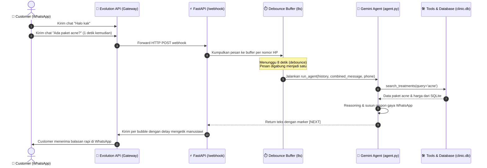

# Modul 00: Pengenalan Arsitektur & Lingkungan Belajar

Selamat datang di Modul 00! Sebelum masuk ke baris kode, kita perlu memahami gambaran besar (*big picture*) arsitektur AI Sales Agent ini dan menyiapkan lingkungan pengembangan lokal Anda.

---

## 🎯 Tujuan Pembelajaran

Setelah menyelesaikan modul ini, Anda akan mampu:
1. Menjelaskan siklus hidup pesan customer dari WhatsApp hingga dijawab oleh Gemini AI.
2. Memahami peran setiap komponen: Evolution API, ngrok, FastAPI, Gemini LLM, SQLite, dan Dashboard.
3. Menyiapkan Python virtual environment dan menginstal seluruh dependensi project.
4. Mengonfigurasi berkas `.env` dengan kredensial yang tepat dan memverifikasinya melalui *sanity check script*.

---

## 🧩 Konsep & Mental Model Arsitektur

Agen AI untuk WhatsApp sangat berbeda dengan chatbot berbasis web standar. Di WhatsApp, customer sering mengetik beberapa kalimat terputus-putus, mengirim gambar tanpa caption, atau meminta berbicara langsung dengan manusia.

Sistem ini dirancang dengan arsitektur 6 layer:



### Komponen Utama:
1. **Evolution API**: Gateway perantara WhatsApp (menggunakan Baileys protocol) yang mengubah event WhatsApp menjadi HTTP request ke server kita dan sebaliknya.
2. **ngrok / Cloudflared**: Tunnel untuk mengekspos server lokal Anda (`localhost:8000`) ke internet agar bisa diakses oleh webhook Evolution API.
3. **FastAPI (`main.py`)**: Web framework asinkron berkecepatan tinggi yang menerima webhook, melakukan debounce buffering, dan menyajikan dashboard.
4. **Agent Core (`agent.py`)**: Jantung agen berbasis model `gemini-3.1-flash-lite` dengan kemampuan Function Calling dan Vision.
5. **Database (`database.py`)**: SQLModel (SQLite lokal untuk workshop, PostgreSQL untuk production) penyimpan katalog, slot booking, dan chat history.

---

## 🔍 Bedah Konfigurasi (.env.example)

Buka berkas [`.env.example`](../.env.example). Berkas ini mendefinisikan seluruh variabel lingkungan yang mengontrol perilaku sistem:

| Variabel | Default / Contoh | Penjelasan & Alasan Desain |
|:---|:---|:---|
| `GEMINI_API_KEY` | *(wajib diisi)* | API Key dari [Google AI Studio](https://aistudio.google.com). |
| `GEMINI_MODEL` | `gemini-3.1-flash-lite` | Model Gemini generasi 3. Flash-Lite dipilih karena latensinya sangat rendah (~1s) dan hemat biaya untuk agen CS. |
| `GEMINI_THINKING_LEVEL` | `minimal` | Opsi thinking token pada Gemini. Mode `minimal` memastikan agen merespons cepat tanpa over-thinking pada chat sederhana. |
| `BUFFER_SECONDS` | `8` | Jeda waktu debounce. Sistem menunggu 8 detik sebelum memproses pesan customer untuk menampung chat beruntun. |
| `EVOLUTION_API_URL` | `http://localhost:8080` | URL instance Evolution API (lokal atau cloud seperti Zeabur). |
| `EVOLUTION_API_KEY` | `global-api-key` | Kunci autentikasi untuk memanggil API Evolution. |
| `EVOLUTION_INSTANCE` | `glowria` | Nama sesi/instance WhatsApp di Evolution API. |
| `DATABASE_URL` | `sqlite:///clinic.db` | URL database. Default SQLite lokal `clinic.db`. Di production ganti ke PostgreSQL. |
| `DASHBOARD_API_KEY` | `rahasia123` | Kunci proteksi endpoint admin dashboard (`X-API-Key`). |
| `R2_*` | *(opsional)* | Kredensial Cloudflare R2 / S3 untuk hosting gambar customer. Jika kosong, sistem otomatis fallback simpan ke folder disk `media/`. |

---

## 🧪 Hands-on Lab: Setup & Sanity Check

Mari siapkan lingkungan kerja dan pastikan koneksi Python ke Gemini API berjalan lancar.

### 1. Masuk ke Direktori Project
```bash
cd /home/raygbrn/project/ai/AI-Sales-Agent-Workshop
```

### 2. Buat Virtual Environment & Instal Dependensi
Anda dapat menggunakan `uv` (rekomendasi, sangat cepat) atau `python3 -m venv`:

**Opsi A — Menggunakan `uv`:**
```bash
# Buat virtual environment
uv venv

# Aktifkan virtual environment
source .venv/bin/activate

# Instal dependensi dari pyproject.toml
uv pip install -e .
```

**Opsi B — Menggunakan `python3 -m venv` standard:**
```bash
python3 -m venv .venv
source .venv/bin/activate
pip install -r requirements.txt
```

### 3. Konfigurasi File `.env`
Salin template konfigurasi:
```bash
cp .env.example .env
```
Buka file `.env` menggunakan editor teks Anda dan pastikan `GEMINI_API_KEY` terisi dengan API key Anda:
```env
GEMINI_API_KEY=AIzaSy...
```

### 4. Eksekusi Sanity Check Script
Jalankan satu baris perintah berikut untuk memvalidasi bahwa API key Anda dapat berkomunikasi dengan Gemini:

```bash
python3 -c "
import os
from dotenv import load_dotenv
from google import genai

load_dotenv()
api_key = os.getenv('GEMINI_API_KEY')
if not api_key:
    print('❌ ERROR: GEMINI_API_KEY belum diisi di .env!')
    exit(1)

client = genai.Client(api_key=api_key)
resp = client.models.generate_content(
    model='gemini-2.5-flash',
    contents='Katakan halo dalam 3 kata!'
)
print('✅ KONEKSI SUKSES! Respons Gemini:', resp.text.strip())
"
```

Jika berhasil, Anda akan melihat output:
```
✅ KONEKSI SUKSES! Respons Gemini: Halo! Selamat datang!
```

---

## ⚠️ Pitfalls & Gotchas (Jebakan Umum)

1. **Format Nomor WhatsApp**:
   - Selalu gunakan format internasional tanpa simbol `+` atau spasi, misalnya `6281234567890`.
   - Jangan gunakan format lokal `081234567890` karena webhook WhatsApp dan Evolution API selalu mengidentifikasi pengirim dengan kode negara (`62`).
2. **Rate Limit Free Tier**:
   - Gemini API tier gratis memiliki batas RPM (Request Per Minute) dan TPM (Token Per Minute). Jangan set debounce buffer terlalu kecil (misal 1 detik) karena dapat memicu spam request ke Gemini saat customer mengetik beruntun.
3. **File `.env` Ter-commit ke Git**:
   - Selalu pastikan file `.env` tercantum di dalam `.gitignore`. Jangan pernah memasukkan API Key rahasia ke repository publik.

---

## 🚀 Tantangan Mandiri (Mini Challenge)

Coba tambahkan dua konfigurasi klinik baru di file `.env` Anda:
```env
AI_NAME="Sari"
COMPANY_NAME="Aura Glow Clinic"
```
Buat skrip Python sederhana bernama `test_env.py` yang membaca dan mencetak kedua nilai tersebut. Perhatikan bagaimana nilai default di [agent.py](../agent.py) akan ter-override secara elegan oleh environment variable!

---

## ⏭️ Navigasi

Lingkungan belajar Anda sudah siap! Selanjutnya kita akan membedah bagaimana data katalog klinik dan sistem booking dimodelkan.

👉 **[Lanjut ke Modul 01: Database & Data Modeling](./01-database-dan-data-modeling.md)**
