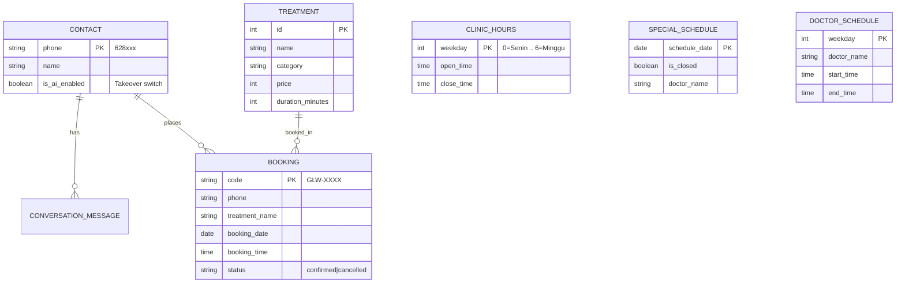

# Modul 01: Database & Data Modeling

Di modul ini, kita akan membedah bagaimana seluruh data klinik (katalog treatment, jadwal buka, dokter praktek, slot booking, hingga histori percakapan) dimodelkan dan disimpan menggunakan **SQLModel**.

---

## 🎯 Tujuan Pembelajaran

Setelah menyelesaikan modul ini, Anda akan mampu:
1. Memahami alasan pemilihan **SQLModel** dibandingkan SQLAlchemy murni atau raw SQL.
2. Membedah 7 entitas data utama di dalam file [`database.py`](../database.py) dan relasinya.
3. Memahami peran konstanta bisnis `TREATMENT_DURATION_MINUTES` dan `MAX_CONCURRENT`.
4. Menjalankan inisialisasi (`init_db`) dan seeding data klinik (`seed_db`).
5. Melakukan query interaktif ke database `clinic.db` secara mandiri.

---

## 🧩 Konsep & Relasi Data (ER Diagram)

Sistem AI Sales Agent ini membutuhkan data terstruktur agar LLM tidak berhalusinasi saat menjawab harga, jam buka, dan ketersediaan dokter. 

### Mengapa SQLModel?
SQLModel menggabungkan keunggulan **Pydantic** (validasi tipe data dan otomatisasi konversi JSON) dengan **SQLAlchemy** (ORM database yang tangguh). Dengan SQLModel, satu deklarasi class Python berfungsi ganda:
- Sebagai model tabel database.
- Sebagai skema validasi tipe data Python (*type hints*).

### Entity Relationship Diagram:



---

## 🔍 Bedah Kode Mendalam (`database.py`)

Buka berkas [`database.py`](../database.py). Mari kita telaah komponen-komponen kuncinya:

### 1. Konstanta Kapasitas & Durasi
```python
TREATMENT_DURATION_MINUTES = 90  # 1 treatment = 1.5 jam
MAX_CONCURRENT = 3               # klinik punya 3 perawat simultan
```
* **Alasan Desain**: Di klinik estetika Glowria, waktu pelayanan tidak menggunakan slot kaku (misal jam 10:00, 11:00), melainkan berbasis kapasitas fleksibel. Customer bisa datang jam 10:15 asalkan tidak ada lebih dari 3 perawat yang sedang sibuk menangani customer lain.

### 2. Entitas Katalog (`Treatment`)
```python
class Treatment(SQLModel, table=True):
    id: Optional[int] = Field(default=None, primary_key=True)
    name: str = Field(index=True)
    category: str = Field(index=True)  # acne, brightening, anti-aging, dll
    price: int
    duration_minutes: int = Field(default=TREATMENT_DURATION_MINUTES)
    description: str
```
* `index=True` ditambahkan pada `name` dan `category` agar pencarian katalog via tool `search_treatments` berlangsung instan.

### 3. Entitas Penjadwalan (`ClinicHours`, `SpecialSchedule`, `DoctorSchedule`)
* **`ClinicHours`**: Menyimpan jam operasional reguler per hari kerja (`weekday` 0 = Senin s/d 6 = Minggu).
* **`DoctorSchedule`**: Menyimpan jadwal reguler dokter (Dr. Amara SpDVE Senin/Rabu/Jumat, Dr. Sinta Selasa/Kamis/Sabtu/Minggu).
* **`SpecialSchedule`**: **Prioritas Tertinggi (Override)**. Digunakan untuk tanggal cuti bersama, libur dadakan, atau perubahan jam dokter pada tanggal kalender spesifik (`YYYY-MM-DD`). Jika tanggal terdaftar di sini, jam reguler diabaikan!

### 4. Entitas Percakapan & Kontak (`Contact`, `ConversationMessage`)
```python
class Contact(SQLModel, table=True):
    phone: str = Field(primary_key=True)
    name: Optional[str] = None
    is_ai_enabled: bool = Field(default=True)  # SAKLAR TAKEOVER

class ConversationMessage(SQLModel, table=True):
    id: Optional[int] = Field(default=None, primary_key=True)
    phone: str = Field(index=True)
    role: str       # 'user' | 'model'
    text: str
    created_at: datetime = Field(default_factory=datetime.now)
```
* `phone` adalah primary key alami di WhatsApp.
* `is_ai_enabled` adalah saklar krusial: jika diset `False` oleh admin lewat dashboard, sistem AI akan berhenti membalas pesan dari nomor tersebut sehingga staf klinik manusia bisa mengambil alih percakapan tanpa terganggu bot.

### 5. Inisialisasi & Seeding Data
* `init_db()`: Menjalankan `SQLModel.metadata.create_all(engine)` untuk membuat file `clinic.db` dan tabel-tabelnya secara otomatis.
* `seed_db()`: Mengisi database dengan katalog perawatan lengkap, jam operasional reguler, jadwal dokter, dan jadwal libur khusus (contoh: libur 24–26 Juni).

---

## 🧪 Hands-on Lab: Eksplorasi Database Mandiri

Mari kita jalankan inisialisasi database dan lakukan query menggunakan skrip Python sederhana.

### 1. Jalankan Skrip Inspeksi
Jalankan perintah berikut di terminal Anda:

```bash
python3 -c "
from sqlmodel import select
from database import init_db, seed_db, get_session, Treatment, ClinicHours, DoctorSchedule

# 1. Pastikan database dan seed terpasang
init_db()
seed_db()

with get_session() as session:
    # 2. Cek Total Treatment
    treatments = session.exec(select(Treatment)).all()
    print(f'✅ Total Treatment Terdaftar: {len(treatments)}')
    
    # 3. Cari Treatment Kategori 'acne'
    acne_treatments = session.exec(
        select(Treatment).where(Treatment.category == 'acne')
    ).all()
    print('\n📋 Contoh Paket Acne:')
    for t in acne_treatments[:3]:
        print(f'  - {t.name}: Rp {t.price:,} ({t.duration_minutes} menit)')
        
    # 4. Cek Jadwal Buka Hari Senin (weekday 0)
    senin = session.get(ClinicHours, 0)
    print(f'\n🕒 Jam Operasional Senin: {senin.open_time} - {senin.close_time}')
    
    # 5. Cek Jadwal Dokter
    docs = session.exec(select(DoctorSchedule)).all()
    print('\n👩‍⚕️ Jadwal Dokter:')
    hari = ['Senin', 'Selasa', 'Rabu', 'Kamis', 'Jumat', 'Sabtu', 'Minggu']
    for d in docs:
        print(f'  - {hari[d.weekday]}: {d.doctor_name} ({d.start_time} - {d.end_time})')
"
```

### 2. Output yang Diharapkan:
```text
✅ Total Treatment Terdaftar: 29

📋 Contoh Paket Acne:
  - Paket Acne A: Peeling Acne + Meso Purifying: Rp 275,000 (90 menit)
  - Paket Acne B: IPL Acne + Meso Purifying: Rp 425,000 (90 menit)
  - Paket Acne C: IPL Acne + Skin Booster Acne: Rp 950,000 (90 menit)

🕒 Jam Operasional Senin: 10:00:00 - 18:00:00

👩‍⚕️ Jadwal Dokter:
  - Senin: Dr. Amara, SpDVE (12:00:00 - 16:00:00)
  - Selasa: Dr. Sinta (11:00:00 - 17:00:00)
  ...
```

---

## ⚠️ Pitfalls & Gotchas

1. **Format Tipe Data Jam (`datetime.time`) di SQLite**:
   - SQLite tidak memiliki tipe bawaan `TIME` native; SQLModel menyimpannya sebagai string terformat `HH:MM:SS`. Selalu gunakan helper `_parse_time()` atau objek `time` saat melakukan komparasi.
2. **Database Concurrency Lock pada SQLite**:
   - SQLite menggunakan file lock saat operasi tulis (*write*). Pada pengujian lokal atau demonstrasi workshop hal ini sangat cepat dan praktis. Namun untuk *traffic* WhatsApp produksi skala tinggi, ganti `DATABASE_URL` di `.env` ke PostgreSQL.
3. **Primary Key `Contact.phone`**:
   - Jika customer berganti nomor, mereka dianggap sebagai kontak baru. Format nomor harus seragam (selalu diawali kode negara tanpa tanda plus: `628...`).

---

## 🚀 Tantangan Mandiri (Mini Challenge)

Buat skrip kecil bernama `cek_promo.py` yang mencari semua treatment dengan harga di bawah Rp 500.000 dan mengurutkannya dari yang termurah ke yang termahal:

```python
from sqlmodel import select
from database import get_session, Treatment

with get_session() as session:
    # Tulis query select dengan filter price <= 500_000 dan order_by price
    # ...
    pass
```
*Petunjuk: Gunakan `select(Treatment).where(Treatment.price <= 500000).order_by(Treatment.price)`.*

---

## ⏭️ Navigasi

Sekarang Anda sudah menguasai layer data persistensi klinik. Di modul berikutnya, kita akan mempelajari bagaimana membentuk kepribadian dan aturan ketat agen AI agar berbicara layaknya admin WhatsApp profesional.

👉 **[Lanjut ke Modul 02: Prompt Engineering & Guardrails](./02-prompt-engineering-dan-guardrails.md)**
