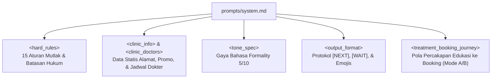

# Modul 02: Prompt Engineering & Guardrails Percakapan

Di modul ini, kita akan membongkar "otak dan kepribadian" dari AI Sales Agent: file [`prompts/system.md`](../prompts/system.md). Anda akan mempelajari bagaimana merancang prompt kelas produksi dengan batasan (*guardrails*) ketat, tone suara WhatsApp yang alami, dan protokol kontrol percakapan.

---

## 🎯 Tujuan Pembelajaran

Setelah menyelesaikan modul ini, Anda akan mampu:
1. Memahami struktur modular berbasis XML/Tags dalam penulisan *system prompt* yang kompleks.
2. Menguasai teknik *Tone of Voice Engineering* agar AI berbicara seperti admin WhatsApp manusia Indonesia (bukan bot kaku).
3. Menerapkan 15 *Hard Rules* sebagai *guardrails* anti-halusinasi dan kepatuhan medis klinik.
4. Memahami protokol delimiter percakapan: `[NEXT]`, `[WAIT]`, dan `[HANDOVER]`.
5. Memahami strategi *Prompt Caching* untuk menghemat biaya token dan mempercepat respons Gemini.

---

## 🧩 Konsep & Anatomi System Prompt

Menulis prompt untuk agen penjualan WhatsApp jauh lebih rumit daripada membuat prompt chatbot biasa. Agen harus:
- **Tegas membatasi diri**: Tidak boleh mendiagnosis penyakit kulit sembarangan (aspek legal/medis).
- **Berbicara ringkas**: Memecah jawaban menjadi beberapa balon chat (*chat bubbles*) berurutan, bukan 1 paragraf panjang yang melelahkan dibaca.
- **Tahu kapan harus diam**: Berhenti dan menunggu balasan customer setelah mengajukan pertanyaan.

### Struktur Tag Berkas `prompts/system.md`:



---

## 🔍 Bedah Kode Mendalam (`prompts/system.md` & `agent.py`)

### 1. Tone Specification (Formality 5/10)
Buka bagian `<tone_spec>` pada [prompts/system.md](../prompts/system.md):
```markdown
FORMALITY LEVEL: 5/10

LANGUAGE RULES:
- Use "saya" not "aku"
- Use casual words: "buat" (not "untuk"), "kalo" (not "kalau"), "udah" (not "sudah"), 
  "aja" (not "saja"), "gimana" (not "bagaimana"), "sampe" (not "sampai"), "yaa kak" as softener
- Avoid overly formal: "untuk", "kalau", "sudah", "saja"
- Avoid overly slang: "nih", "dong", "sih", "wkwk", "hehe", "gaskeun", "cuss"
```
* **Alasan Desain**: Admin klinik kecantikan di WhatsApp harus terdengar ramah (*warm*) dan profesional. Kata "aku" terasa terlalu akrab/kurang sopan, sedangkan kata baku seperti "bagaimana" dan "untuk" terasa seperti surat dinas atau bot perbankan kaku.

### 2. Protokol Delimiter WhatsApp (`[NEXT]`, `[WAIT]`, `[HANDOVER]`)

Ini adalah inovasi terpenting dalam agen percakapan ini:

#### A. Pemisah Bubble (`[NEXT]`)
Customer di WhatsApp tidak suka membaca teks panjang. LLM diinstruksikan untuk menyisipkan marker `[NEXT]` di antara kalimat:
```text
Halo kak, selamat siang 😊[NEXT]Untuk jerawat meradang, kakak bisa coba Peeling Acne ya kak[NEXT]Tertarik untuk konsultasi dulu kak?[WAIT]
```
Di layer pengiriman ([`whatsapp.py`](../whatsapp.py) & [`cli.py`](../cli.py)), string dipecah berdasarkan `[NEXT]` dan dikirim sebagai bubble terpisah dengan delay mengetik beberapa detik.

#### B. Turn-Taking Marker (`[WAIT]`)
Aturan mutlak di `<stop_behavior>`:
```markdown
Setiap kali kamu mengajukan pertanyaan -> akhiri dengan [WAIT] -> BERHENTI sepenuhnya.
JANGAN menambahkan informasi lagi setelah [WAIT].
```
Tanpa marker `[WAIT]`, LLM cenderung "berceramah sendiri" (misal: bertanya *"Mau booking jam berapa?"* lalu langsung menambahkan *"Oh iya kak kami juga ada promo lain..."* tanpa menunggu jawaban customer).

#### C. Human Handover Tag (`[HANDOVER]`)
Jika customer meminta berbicara dengan admin, atau menyampaikan keluhan medis berat, prompt mewajibkan agen mengakhiri chat dengan literal string:
```text
Mohon maaf kak, saya sambungkan ke admin klinik yaa 🙏[HANDOVER]
```
Sistem backend mendeteksi teks `[HANDOVER]`, mengirim notifikasi ke staf klinik, dan otomatis menonaktifkan AI untuk nomor customer tersebut.

---

### 3. Guardrails Kritis (`<hard_rules>`)

Beberapa aturan terpenting dari 15 aturan mutlak:
* **Rule 1 & 2**: Jangan pernah mengaku AI. Jangan menyapa nama customer di awal sebelum recap konfirmasi (agar terkesan natural seperti admin WhatsApp yang belum menyimpan kontak).
* **Rule 4 & 5**: Pantang memberikan diagnosis medis mandiri.
* **Rule 8 & 9**: Seluruh harga dan paket perawatan **HARUS** diperoleh dari hasil tool `search_treatments`. Dilarang mengarang harga sendiri!
* **Rule 10 & 14**: Dilarang mengarang klinik tutup atau dokter libur tanpa konfirmasi dari status jadwal di context/tool.

---

### 4. Strategi Prompt Caching di `agent.py`

Buka fungsi `render_system_prompt()` di [`agent.py`](../agent.py):
```python
def render_system_prompt() -> str:
    raw = (Path(__file__).parent / "prompts" / "system.md").read_text(encoding="utf-8")
    replacements = {
        "{{aiName}}": AI_NAME,
        "{{companyName}}": COMPANY_NAME,
        "{{currentDateContext}}": "Tanggal dan jam SAAT INI selalu diberikan di awal setiap pesan customer...",
        # ...
    }
    for key, value in replacements.items():
        raw = raw.replace(key, value)
    return raw
```

> [!IMPORTANT]
> **Mengapa tanggal/jam real-time TIDAK di-hardcode ke dalam system prompt?**
> Google Gemini menyediakan fitur **Context Caching**. Jika system prompt tidak berubah (identik antar request), token system prompt (~3.000+ token) akan di-cache secara otomatis oleh server Gemini. Biaya request menjadi jauh lebih murah dan latensi respon menjadi 2–3x lebih cepat! Data dinamis (waktu sekarang, nomor HP customer) diinjeksi via pesan user di fungsi `run_agent()`.

---

## 🧪 Hands-on Lab: Uji Render Prompt & Parser Delimiter

Mari kita buat skrip pengujian untuk melihat bagaimana system prompt di-render dan bagaimana delimiter diurai.

### 1. Jalankan Skrip Pengujian di Terminal
```bash
python3 -c "
from agent import render_system_prompt

# 1. Render prompt
prompt = render_system_prompt()
print(f'✅ Panjang Karakter System Prompt: {len(prompt):,} karakter')

# 2. Pastikan tidak ada template placeholder yang bocor
unreplaced = [tag for tag in ['{{aiName}}', '{{companyName}}', '{{currentDateContext}}'] if tag in prompt]
if unreplaced:
    print(f'❌ Ada placeholder belum terisi: {unreplaced}')
else:
    print('✅ Semua template variables berhasil di-replace dengan benar!')

# 3. Simulasi Parser Bubble WhatsApp
sample_ai_output = 'Halo kak, selamat siang 😊[NEXT]Buat keluhan jerawat, ada paket Facial Acne yaa kak[NEXT]Mau saya bantu jadwalkan konsultasi? 🙏[WAIT]'

print('\n📱 Simulasi Parsing Pesan ke WhatsApp Bubbles:')
clean_output = sample_ai_output.replace('[WAIT]', '').replace('[HANDOVER]', '')
bubbles = [b.strip() for b in clean_output.split('[NEXT]') if b.strip()]

for idx, b in enumerate(bubbles, 1):
    print(f'  Bubble {idx}: \"{b}\"')
"
```

### 2. Output yang Diharapkan:
```text
✅ Panjang Karakter System Prompt: 37,294 karakter
✅ Semua template variables berhasil di-replace dengan benar!

📱 Simulasi Parsing Pesan ke WhatsApp Bubbles:
  Bubble 1: "Halo kak, selamat siang 😊"
  Bubble 2: "Buat keluhan jerawat, ada paket Facial Acne yaa kak"
  Bubble 3: "Mau saya bantu jadwalkan konsultasi? 🙏"
```

---

## ⚠️ Pitfalls & Gotchas

1. **Model Mengabaikan `[WAIT]`**:
   - Jika model menggunakan temperature terlalu tinggi (misal `> 0.9`), model bisa berimprovisasi dan melanggar aturan stop. Di [agent.py](../agent.py), `temperature` diset pada angka aman `0.7`.
2. **Kebocoran Nama Tool**:
   - Terkadang model pemula menulis: *"Baik kak, saya akan memanggil fungsi book_treatment"*. Rule nomor 3 di `<hard_rules>` secara tegas melarang hal ini.
3. **Double Greeting**:
   - Customer yang sudah pernah berinteraksi tidak boleh disapa *"Halo selamat pagi"* lagi di setiap giliran chat. Bagian `<no_repeat_greeting>` di prompt mencegah perilaku mengganggu ini.

---

## 🚀 Tantangan Mandiri (Mini Challenge)

Buka file [`prompts/system.md`](../prompts/system.md). Cari bagian `<warmth_phrases>`.
Tambahkan variasi frasa penyemangat hangat baru khas Indonesia, misalnya:
- *"Semangat yaa kak perawatannya 😊"*
- *"Biar kulitnya makin sehat glowing 🥰"*

Jalankan skrip tes untuk memastikan file tetap terbaca tanpa syntax error!

---

## ⏭️ Navigasi

Anda telah memahami bagaimana kepribadian dan aturan ketat Gita dibentuk. Sekarang, bagaimana Gita dapat memeriksa database secara real-time dan mengeksekusi booking?

👉 **[Lanjut ke Modul 03: Function Calling & Algoritma Booking Engine](./03-function-calling-dan-booking-engine.md)**
