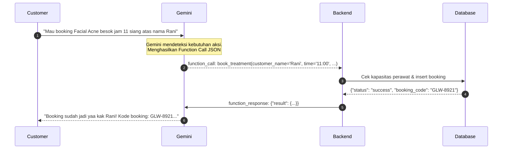

# Modul 03: Function Calling & Algoritma Booking Engine

Di modul ini, kita akan membedah berkas [`tools.py`](../tools.py). Anda akan mempelajari bagaimana Google Gemini berinteraksi dengan dunia nyata melalui **Function Calling** dan bagaimana algoritma penjadwalan kapasitas paralel 3 perawat bekerja.

---

## 🎯 Tujuan Pembelajaran

Setelah menyelesaikan modul ini, Anda akan mampu:
1. Memahami mekanisme dasar **Gemini Function Calling** (bagaimana model memutuskan memanggil tools).
2. Membedah deklarasi skema fungsi pada `TOOL_DECLARATIONS` dan registrasinya di `TOOL_FUNCTIONS`.
3. Memahami algoritma kapasitas klinik berdurasi 90 menit dengan 3 perawat simultan (`MAX_CONCURRENT=3`).
4. Menguasai logika deteksi *overlap* jadwal dan algoritma pencarian slot pengganti terdekat (`_next_available_slot`).
5. Menjalankan pengujian mandiri (*unit testing*) untuk skenario *slot conflict* saat kuota perawat penuh.

---

## 🧩 Konsep & Mental Model Function Calling

Sering ada kesalahpahaman bahwa LLM mengeksekusi kode Python secara langsung. Faktanya:
1. Kita mengirimkan deskripsi fungsi (nama, deskripsi, dan parameter yang dibutuhkan) ke Gemini.
2. Ketika customer bertanya, Gemini menganalisis apakah pertanyaan tersebut membutuhkan data dinamis.
3. Jika ya, Gemini **berhenti menghasilkan teks** dan mengembalikan objek JSON `function_call` yang berisi nama fungsi dan nilai argumennya.
4. Server lokal kita mengeksekusi fungsi Python tersebut ke database, lalu mengirimkan hasilnya kembali ke Gemini.
5. Gemini membaca hasil tersebut dan merangkai jawaban ramah untuk customer.



---

## 🔍 Bedah Algoritma Kapasitas Paralel (`tools.py`)

Klinik Glowria tidak menggunakan slot waktu statis yang kaku (misalnya: hanya boleh jam 10:00, 11:30, 13:00). Customer bebas memesan jam berapapun selama jam buka klinik, dengan aturan:
- Setiap treatment memakan waktu **90 menit** (`TREATMENT_DURATION_MINUTES = 90`).
- Klinik memiliki **3 perawat** yang bekerja bersamaan (`MAX_CONCURRENT = 3`).
- Sebuah jam baru dinyatakan **PENUH** jika pada rentang $[t_{start}, t_{start} + 90\text{ menit})$ sudah ada 3 perawat yang terisi penuh oleh booking lain.

### 1. Logika Deteksi Overlap (`_count_overlap`)
Buka fungsi `_count_overlap()` di [`tools.py`](../tools.py):
```python
def _count_overlap(session, d: date, start: time, duration: int = TREATMENT_DURATION_MINUTES) -> int:
    """Hitung booking aktif yang OVERLAP dengan rentang [start, start+duration)."""
    start_m = _minutes(start)
    end_m = start_m + duration

    bookings = session.exec(
        select(Booking).where(Booking.booking_date == d, Booking.status != "cancelled")
    ).all()

    count = 0
    for b in bookings:
        b_start = _minutes(b.booking_time)
        b_end = b_start + b.duration_minutes
        # Dua rentang [A, B) dan [C, D) overlap jika A < D dan C < B:
        if start_m < b_end and b_start < end_m:
            count += 1
    return count
```

### 2. Logika Mencari Slot Terdekat (`_next_available_slot`)
Jika slot jam 11:00 penuh, sistem tidak langsung menolak customer, melainkan mencari kapan perawat pertama selesai:
```python
def _next_available_slot(session, d: date, after: time, rules: dict) -> Optional[str]:
    """Cari slot tercepat yang masih available SETELAH waktu yang diminta."""
    # Sistem melangkah per 15 menit ke depan hingga jam operasional tutup
    # Mengembalikan waktu pertama di mana _count_overlap < MAX_CONCURRENT
```

### 3. Validasi Jam Terakhir (Last Valid Slot)
Treatment membutuhkan waktu 90 menit. Jika klinik tutup jam 18:00, maka slot booking terakhir yang sah adalah **16:30** (selesai tepat jam 18:00).
- Booking jam 17:00 akan ditolak oleh `book_treatment` dengan status `OUTSIDE_HOURS` karena akan selesai pukul 18:30 (melewati jam tutup klinik).

---

## 🔍 6 Fungsi Bisnis Utama di `tools.py`

| Nama Tool | Kegunaan | Parameter Kunci |
|:---|:---|:---|
| `search_treatments` | Mencari katalog perawatan dan harga berdasarkan nama, kategori, atau keluhan | `query` (string) |
| `check_available_schedule` | Menghasilkan daftar slot jam yang masih available dan yang sudah penuh pada tanggal tertentu | `booking_date` (YYYY-MM-DD) |
| `book_treatment` | Membuat pesanan booking atomik (mengecek overlap, jam operasional, status libur khusus, lalu menyimpan ke DB) | `customer_name`, `phone`, `treatment_name`, `booking_date`, `booking_time` |
| `get_my_orders` | Mengambil riwayat booking aktif customer berdasarkan nomor WhatsApp | `phone` |
| `cancel_booking` | Membatalkan booking aktif customer | `booking_code`, `reason` |
| `handover_to_admin` | Mengalihkan percakapan ke admin manusia dan mematikan saklar AI (`is_ai_enabled=False`) | `phone`, `reason` |

---

## 🧪 Hands-on Lab: Simulasi Concurrency Booking

Mari kita uji logika booking secara langsung menggunakan Python tanpa perlu memanggil Gemini API. Kita akan membuktikan bahwa klinik menerima hingga 3 booking di jam yang sama, dan menolak booking ke-4 dengan pesan bentrok.

### 1. Jalankan Skrip Simulasi di Terminal
```bash
python3 -c "
from datetime import date, timedelta
from database import init_db, seed_db
from tools import book_treatment

init_db()
seed_db()

# Gunakan tanggal besok (format YYYY-MM-DD)
besok = (date.today() + timedelta(days=1)).strftime('%Y-%m-%d')
jam_booking = '11:00'

print(f'🗓️ Menjalankan simulasi booking untuk tanggal: {besok} jam {jam_booking}\n')

# 1. Booking Customer 1 (Perawat 1 terisi)
res1 = book_treatment('Customer Satu', '6281111111', 'Facial Acne', besok, jam_booking)
print(f'Booking 1: status={res1[\"status\"]}, kode={res1.get(\"booking_code\")}')

# 2. Booking Customer 2 (Perawat 2 terisi di jam yang sama)
res2 = book_treatment('Customer Dua', '6282222222', 'Facial Acne', besok, jam_booking)
print(f'Booking 2: status={res2[\"status\"]}, kode={res2.get(\"booking_code\")}')

# 3. Booking Customer 3 (Perawat 3 terisi di jam yang sama - KAPASITAS MAKSIMAL)
res3 = book_treatment('Customer Tiga', '6283333333', 'Facial Acne', besok, jam_booking)
print(f'Booking 3: status={res3[\"status\"]}, kode={res3.get(\"booking_code\")}')

# 4. Booking Customer 4 di jam yang sama -> HARUS DITOLAK (SLOT CONFLICT)
print('\n⚡ Mencoba booking ke-4 di jam yang sama (melebihi kapasitas 3 perawat):')
res4 = book_treatment('Customer Empat', '6284444444', 'Facial Acne', besok, jam_booking)
print(f'Booking 4: status={res4[\"status\"]}')
print(f'Pesan Sistem: {res4.get(\"message\")}')
print(f'Saran Slot Terdekat Berikutnya: {res4.get(\"next_available_slot\")}')
"
```

### 2. Output yang Diharapkan:
```text
🗓️ Menjalankan simulasi booking untuk tanggal: 2026-09-29 jam 11:00

Booking 1: status=confirmed, kode=GLW-4A82
Booking 2: status=confirmed, kode=GLW-9B1C
Booking 3: status=confirmed, kode=GLW-2C5E

⚡ Mencoba booking ke-4 di jam yang sama (melebihi kapasitas 3 perawat):
Booking 4: status=slot_conflict
Pesan Sistem: Jam 11:00 sudah penuh (kapasitas 3/3 perawat terisi).
Saran Slot Terdekat Berikutnya: 12:30
```

> [!NOTE]
> Perhatikan bahwa slot terdekat berikutnya adalah **12:30**! Mengapa? Karena treatment perawat 1 yang mulai jam 11:00 (durasi 90 menit) akan selesai pada pukul 12:30, sehingga perawat pertama baru tersedia kembali di jam tersebut.

---

## ⚠️ Pitfalls & Gotchas

1. **Double Booking Race Condition**:
   - Jika dua customer mengonfirmasi booking di milidetik yang sama, kedua transaksi harus divalidasi secara atomik di database agar kapasitas tidak terlewati (`> 3`). Di fungsi `book_treatment`, penghitungan `_count_overlap` dilakukan langsung di dalam session transaksi sebelum commit.
2. **Kesesuaian Tipe Parameter Tool**:
   - Parameter function declaration harus bertipe primitif standar OpenAPI (`STRING`, `INTEGER`, `BOOLEAN`). Tipe data kompleks seperti objek Python `datetime` harus dikirim sebagai `string` ISO (`YYYY-MM-DD`).

---

## 🚀 Tantangan Mandiri (Mini Challenge)

Coba uji tool `search_treatments`:
```python
from tools import search_treatments
hasil = search_treatments("flek hitam")
print(hasil)
```
Amati bagaimana kata kunci pencarian mencocokkan field `name`, `category`, dan `description`.

---

## ⏭️ Navigasi

Sekarang kita memiliki data layer dan kumpulan tool aksi yang solid. Di modul selanjutnya, kita akan menggabungkan semuanya ke dalam **Agent Core Loop** di mana Gemini menjalankan reasoning dan mengeksekusi tool secara otomatis!

👉 **[Lanjut ke Modul 04: The Agent Core Loop & Multimodal Vision](./04-agent-core-dan-gemini-loop.md)**
