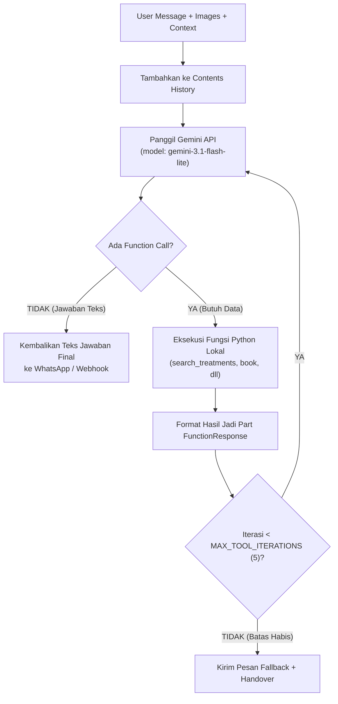

# Modul 04: The Agent Core Loop & Multimodal Vision

Di modul ini, kita akan membedah berkas [`agent.py`](../agent.py) yang merupakan pusat kendali sistem. Anda akan mempelajari arsitektur **Core Agent Loop**, cara kerja multi-turn tool calling iteratif, dan bagaimana agen memproses foto keluhan kulit yang dikirim customer di WhatsApp.

---

## 🎯 Tujuan Pembelajaran

Setelah menyelesaikan modul ini, Anda akan mampu:
1. Memahami penggunaan **Google GenAI SDK** terbaru (`google-genai`).
2. Membedah arsitektur loop percakapan iteratif (`run_agent`) dengan batas `MAX_TOOL_ITERATIONS = 5`.
3. Memahami teknik injeksi konteks waktu dinamis dan nomor telepon tanpa merusak *prompt caching*.
4. Menguasai pemrosesan input multimodal (gambar / foto keluhan customer).
5. Menerapkan mekanisme pemulihan kegagalan (*graceful fallback*) saat terjadi error jaringan atau limit token.

---

## 🧩 Konsep & Siklus Kerja Agent Loop

Ketika agen berinteraksi dengan customer, percakapan seringkali membutuhkan lebih dari satu kali pemanggilan tool. Misalnya, customer bertanya: *"Apakah dokter Amara ada hari ini dan jam berapa?"*. Agen mungkin perlu memeriksa hari ini hari apa, lalu mengecek jadwal dokter di database sebelum merangkai jawaban.

Siklus ini ditangani oleh **Agent Core Loop**:



---

## 🔍 Bedah Kode Mendalam (`agent.py`)

### 1. Lazy Client Initialization
```python
_client: genai.Client | None = None

def get_client() -> genai.Client:
    """Lazy init: client baru dibuat saat pertama dibutuhkan."""
    global _client
    if _client is None:
        api_key = os.getenv("GEMINI_API_KEY")
        if not api_key:
            raise RuntimeError("GEMINI_API_KEY belum diisi...")
        _client = genai.Client(api_key=api_key)
    return _client
```
* **Alasan Desain**: Klien tidak dibuat di level modul (*top-level*). Dengan begitu, file `agent.py` dapat di-import oleh skrip pengujian atau modul lain tanpa memicu crash seketika jika `GEMINI_API_KEY` belum diset.

### 2. Konfigurasi Model & Thinking Level
```python
GENERATE_CONFIG = types.GenerateContentConfig(
    system_instruction=SYSTEM_PROMPT,
    tools=[types.Tool(function_declarations=TOOL_DECLARATIONS)],
    thinking_config=types.ThinkingConfig(thinking_level=THINKING_LEVEL),
    temperature=0.7,
)
```
* `gemini-3.1-flash-lite` dikombinasikan dengan `thinking_level="minimal"` memberikan keseimbangan terbaik antara kecerdasan bernalar, kecepatan balasan WhatsApp (< 2 detik), dan efisiensi biaya.

### 3. Injeksi Konteks Dinamis (Ramah Caching)
```python
now = datetime.now()
date_ctx = f"Hari ini {HARI[now.weekday()]}, {now.day} {BULAN[now.month - 1]} {now.year} ({now:%Y-%m-%d}), pukul {now:%H:%M}"

parts = [types.Part(text=f"[Konteks: {date_ctx}. Nomor WhatsApp customer: {phone}]\n{user_message}")]
```
* Perhatikan bahwa `date_ctx` dan `phone` disisipkan di awal pesan *user*, **bukan** di `system_instruction`. Ini menjaga `SYSTEM_PROMPT` tetap statis sehingga Google Gemini dapat memanfaatkan **Context Caching** secara optimal.

### 4. Multimodal Vision: Membaca Gambar Keluhan Kulit
Jika customer melampirkan foto (misalnya foto jerawat atau bekas luka), berkas gambar diubah menjadi bytes dan disisipkan langsung ke list `parts`:
```python
for img_bytes, mime in (images or []):
    parts.append(types.Part.from_bytes(data=img_bytes, mime_type=mime))
```
Gemini secara bawaan adalah model multimodal native. Model dapat membaca foto kulit customer, mencocokkannya dengan keluhan pada teks, dan merekomendasikan treatment yang relevan dari katalog.

### 5. Loop Iteratif & Penanganan Multiple Function Calls
```python
for _ in range(MAX_TOOL_ITERATIONS):
    response = get_client().models.generate_content(...)
    candidate = response.candidates[0]
    contents.append(candidate.content)

    function_calls = response.function_calls or []
    if not function_calls:
        return (response.text or FALLBACK_MESSAGE), contents

    result_parts = []
    for fc in function_calls:
        print(f"  [tool] {fc.name}({dict(fc.args)})")
        func = TOOL_FUNCTIONS.get(fc.name)
        # Eksekusi fungsi python lokal...
        result = func(**dict(fc.args))
        result_parts.append(types.Part.from_function_response(
            name=fc.name, response={"result": result}
        ))
    contents.append(types.Content(role="user", parts=result_parts))
```
* `for fc in function_calls`: Gemini dapat meminta pemanggilan **beberapa fungsi sekaligus** dalam satu giliran. Loop ini mengeksekusi semuanya dan mengirim seluruh hasilnya kembali ke model.
* Batas `MAX_TOOL_ITERATIONS = 5` memastikan agen tidak terjebak dalam perulangan tanpa akhir jika ada parameter yang membingungkan.

---

## 🧪 Hands-on Lab: Menjalankan Agen Mandiri

Mari kita jalankan simulasi percakapan langsung dengan `run_agent()` menggunakan skrip Python di terminal.

> [!NOTE]
> Pastikan file `.env` Anda sudah terisi `GEMINI_API_KEY` yang valid sebelum menjalankan lab ini.

### 1. Jalankan Skrip Chat Sederhana
```bash
python3 -c "
import os
from database import init_db, seed_db
from agent import run_agent

init_db()
seed_db()

phone = '6281234567890'
history = []

print('🤖 Memulai simulasi percakapan dengan Gita...')

# Turn 1: Customer bertanya rekomendasi perawatan
pesan_1 = 'Halo kak, wajah saya kusam dan ada flek hitam, rekomendasi treatment apa ya?'
print(f'\n👤 Customer: {pesan_1}')

reply_1, history = run_agent(history, pesan_1, phone=phone)
print('\n👩‍💼 Gita:')
for bubble in reply_1.replace('[WAIT]', '').split('[NEXT]'):
    if bubble.strip():
        print(f'  [Bubble] {bubble.strip()}')
"
```

### 2. Apa yang Terjadi di Balik Layar?
Saat skrip di atas berjalan:
1. Anda akan melihat log di konsol: `[tool] search_treatments({'query': 'flek hitam'})`.
2. Gemini otomatis memanggil database untuk mencari paket perawatan flek hitam.
3. Gita merespons dalam 2–3 bubble ramah lengkap dengan nama paket, manfaat, dan harga final.

---

## ⚠️ Pitfalls & Gotchas

1. **Format SDK Generative AI**:
   - Project ini menggunakan package modern `google-genai` (`from google import genai`), bukan package lama yang di-deprecate (`google-generativeai`). Jangan mencampuradukkan dokumentasi kedua package tersebut.
2. **Histori yang Menumpuk**:
   - Setiap iterasi tool call menambahkan item ke objek `contents`. Jika percakapan berlangsung sangat lama, ukuran token akan terus membengkak. Di modul berikutnya ([Modul 05](./05-webhook-debounce-dan-memory.md)), kita akan mempelajari bagaimana `memory.py` membatasi histori dengan teknik *sliding window*.

---

## 🚀 Tantangan Mandiri (Mini Challenge)

Coba modifikasi skrip pengujian di atas untuk melanjutkan ke **Turn 2**:
```python
pesan_2 = "Boleh kak yang paket pertama, kalau besok jam 2 siang available ga?"
reply_2, history = run_agent(history, pesan_2, phone=phone)
```
Amati bagaimana Gita mempertahankan konteks dari percakapan sebelumnya (*multi-turn conversation*) tanpa kehilangan informasi!

---

## ⏭️ Navigasi

Agen cerdas kita sudah berfungsi. Namun, bagaimana jika customer WhatsApp mengirimkan 5 pesan berturut-turut dalam 3 detik? Bagaimana sistem mengelolanya tanpa boros token dan tanpa respon bertabrakan?

👉 **[Lanjut ke Modul 05: Session State, Debounce Webhook & Media Storage](./05-webhook-debounce-dan-memory.md)**
