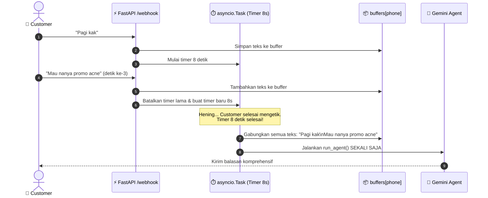

# Modul 05: Session State, Debounce Webhook & Media Storage

Di modul ini, kita akan membedah dua berkas krusial yang membuat sistem ini siap menghadapi kondisi dunia nyata di WhatsApp: [`memory.py`](../memory.py) dan [`main.py`](../main.py). Anda akan mempelajari manajemen memori jangka pendek (*sliding window*), penanganan chat putus-putus melalui **Debounce Buffer**, serta penyimpanan file media gambar.

---

## 🎯 Tujuan Pembelajaran

Setelah menyelesaikan modul ini, Anda akan mampu:
1. Memahami manajemen riwayat percakapan menggunakan teknik **Sliding Window** (`MEMORY_WINDOW`) dan **Session TTL**.
2. Memahami masalah perilaku pengguna WhatsApp yang sering mengirim banyak chat pendek terpisah (*rapid incoming messages*).
3. Menguasai arsitektur **Asyncio Debounce Buffer** dan pencegahan *race condition* menggunakan `asyncio.Lock` per nomor HP.
4. Memahami mekanisme abstraksi penyimpanan gambar (penyimpanan disk lokal vs Cloudflare R2 / AWS S3).
5. Menjalankan simulasi penggabungan pesan beruntun secara mandiri.

---

## 🧩 Konsep Masalah WhatsApp & Solusi Debounce

### Masalah Nyata di WhatsApp
Pengguna WhatsApp hampir tidak pernah mengetik satu paragraf lengkap sekaligus. Perilaku umum customer:
* Jam 10:00:01: *"Pagi kak"*
* Jam 10:00:03: *"Mau nanya"*
* Jam 10:00:06: *"Treatment jerawat yang diskon apa ya?"*

Jika setiap webhook langsung diteruskan ke Gemini LLM:
1. Server akan memanggil Gemini **3 kali**.
2. Biaya token membengkak 3x lipat.
3. Respons AI akan saling tumpang tindih (*race condition*) dan membingungkan customer.

### Solusi: Debounce Buffer (8 Detik)
Sistem menahan pesan yang masuk ke dalam *buffer list* sementara selama 8 detik (`BUFFER_SECONDS = 8`). Jika ada pesan baru masuk dalam jeda tersebut, timer di-reset. Ketika customer berhenti mengetik selama 8 detik, seluruh pesan digabung menjadi satu kesatuan dan dikirim ke Gemini dalam **1 panggilan efisien**.



---

## 🔍 Bedah Kode Mendalam (`memory.py` & `main.py`)

### 1. Sliding Window & Session TTL (`memory.py`)
Buka fungsi `get_history()` di [`memory.py`](../memory.py):
```python
MEMORY_WINDOW = int(os.getenv("MEMORY_WINDOW", "20"))
SESSION_TTL_HOURS = int(os.getenv("SESSION_TTL_HOURS", "24"))

class Memory:
    def get_history(self, phone: str) -> list:
        with get_session() as session:
            rows = session.exec(
                select(ConversationMessage)
                .where(ConversationMessage.phone == phone)
                .order_by(ConversationMessage.created_at.desc())
                .limit(MEMORY_WINDOW)
            ).all()

        if not rows:
            return []

        rows = list(reversed(rows))  # Urutkan kembali ke kronologis asli

        # Session TTL Check:
        if SESSION_TTL_HOURS > 0:
            last = rows[-1].created_at
            if datetime.now() - last > timedelta(hours=SESSION_TTL_HOURS):
                return []  # Sesi baru: AI tidak mengingat chat basi kemarin lusa

        return [
            types.Content(role=m.role, parts=[types.Part(text=m.text)])
            for m in rows
        ]
```
* **Sliding Window (`limit(20)`)**: Hanya membawa 20 pesan terakhir ke Gemini. Ini mencegah *token bloat* dan menjaga percakapan tetap relevan.
* **Session TTL (24 Jam)**: Jika customer terakhir chat 3 hari lalu, histori lama tidak dikirim ke AI agar AI menyapa sebagai sesi baru (namun histori tetap tersimpan di database untuk audit dashboard).

---

### 2. Implementasi Debounce Engine di `main.py`
Buka bagian penanganan buffer di [`main.py`](../main.py):
```python
buffers: dict[str, list[dict]] = defaultdict(list)
buffer_tasks: dict[str, asyncio.Task] = {}
locks: dict[str, asyncio.Lock] = defaultdict(asyncio.Lock)
```
Tiga struktur data kunci:
1. `buffers[phone]`: Menyimpan antrean pesan teks dan gambar yang belum diproses untuk nomor telepon tersebut.
2. `buffer_tasks[phone]`: Menyimpan referensi ke `asyncio.Task` timer debounce yang sedang berjalan.
3. `locks[phone]`: Menjamin bahwa pemrosesan agen untuk nomor tertentu tidak pernah berjalan beriringan (*concurrent execution conflict*).

Alur saat pesan webhook masuk:
```python
# Batalkan task timer sebelumnya jika customer masih terus mengetik:
if phone in buffer_tasks and not buffer_tasks[phone].done():
    buffer_tasks[phone].cancel()

# Buat task timer baru:
buffer_tasks[phone] = asyncio.create_task(_process_buffer(phone))
```

Di dalam `_process_buffer()`:
```python
async def _process_buffer(phone: str):
    await asyncio.sleep(BUFFER_SECONDS)  # Jeda hening 8 detik
    async with locks[phone]:
        # Ambil dan kosongkan buffer untuk nomor ini
        items = buffers.pop(phone, [])
        # Gabungkan teks pesan
        combined_text = "\n".join(t for t in texts if t)
        # Eksekusi AI dan kirim balasan ke WhatsApp
        # ...
```

---

### 3. Media Storage: Abstraksi Lokal vs Cloudflare R2
Fungsi `save_media()` di [`main.py`](../main.py) menyediakan arsitektur hibrida:
```python
R2_ENABLED = all([R2_ENDPOINT, R2_ACCESS_KEY_ID, R2_SECRET_ACCESS_KEY, R2_BUCKET, R2_PUBLIC_URL])

def save_media(phone: str, data: bytes, mime: str) -> str:
    fname = f"{phone}_{uuid.uuid4().hex[:8]}.{EXT.get(mime, 'jpg')}"
    if R2_ENABLED:
        _get_s3().put_object(Bucket=R2_BUCKET, Key=fname, Body=data, ContentType=mime)
    else:
        (MEDIA_DIR / fname).write_bytes(data)
    return f"media/{fname}"
```
* **Developer-Friendly**: Saat baru clone repositori dan belajar di lokal, Anda tidak perlu repot membuat akun cloud storage; sistem otomatis menyimpan gambar ke folder `media/`.
* **Production-Ready**: Cukup isi kredensial `R2_*` di `.env`, maka gambar customer otomatis diunggah ke *object storage* S3/Cloudflare R2 tanpa mengubah satu baris kode pun di aplikasi.

---

## 🧪 Hands-on Lab: Simulasi Asyncio Debounce Buffer

Mari kita uji logika debounce buffer secara langsung menggunakan skrip Python asinkron sederhana.

### 1. Jalankan Skrip Simulasi di Terminal
```bash
python3 -c "
import asyncio
from collections import defaultdict

buffers = defaultdict(list)
buffer_tasks = {}

async def process_buffer(phone: str):
    try:
        print(f'⏱️ [Timer dimulai] Menunggu 3 detik hening untuk {phone}...')
        await asyncio.sleep(3)
        items = buffers.pop(phone, [])
        combined = '\n'.join(items)
        print(f'\n🚀 [PROSES BUFFER SELESAI] Pesan digabung dikirim ke AI:\n\"\"\"\n{combined}\n\"\"\"\n')
    except asyncio.CancelledError:
        print(f'🔄 [Timer di-reset] Pesan baru masuk dari {phone}, timer diulang!')

async def receive_message(phone: str, text: str):
    buffers[phone].append(text)
    if phone in buffer_tasks and not buffer_tasks[phone].done():
        buffer_tasks[phone].cancel()
    buffer_tasks[phone] = asyncio.create_task(process_buffer(phone))

async def main():
    phone = '628123456789'
    print('👤 Customer mulai mengetik beruntun:')
    
    await receive_message(phone, 'Pagi kak Gita')
    await asyncio.sleep(1)  # Customer jeda 1 detik lalu ketik lagi
    
    await receive_message(phone, 'Mau tanya soal treatment jerawat')
    await asyncio.sleep(1)  # Customer jeda 1 detik lagi
    
    await receive_message(phone, 'Ada promo buat mahasiswa ga ya?')
    
    # Tunggu sampai debounce timer selesai memproses
    await buffer_tasks[phone]

asyncio.run(main())
"
```

### 2. Output yang Diharapkan:
```text
👤 Customer mulai mengetik beruntun:
⏱️ [Timer dimulai] Menunggu 3 detik hening untuk 628123456789...
🔄 [Timer di-reset] Pesan baru masuk dari 628123456789, timer diulang!
⏱️ [Timer dimulai] Menunggu 3 detik hening untuk 628123456789...
🔄 [Timer di-reset] Pesan baru masuk dari 628123456789, timer diulang!
⏱️ [Timer dimulai] Menunggu 3 detik hening untuk 628123456789...

🚀 [PROSES BUFFER SELESAI] Pesan digabung dikirim ke AI:
"""
Pagi kak Gita
Mau tanya soal treatment jerawat
Ada promo buat mahasiswa ga ya?
"""
```

---

## ⚠️ Pitfalls & Gotchas

1. **Penggunaan Dict Global Tanpa Pembersihan**:
   - Jika `buffers.pop(phone, [])` tidak dipanggil setelah selesai, memori RAM server akan bocor (*memory leak*) seiring bertambahnya ribuan nomor yang masuk.
2. **Ketiadaan `asyncio.Lock`**:
   - Jika customer mengetik tepat saat timer 8 detik selesai, dua coroutine bisa membaca memori secara bersamaan dan menghasilkan jawaban ganda. `async with locks[phone]` wajib digunakan untuk membatasi eksekusi menjadi satu antrean per nomor.

---

## 🚀 Tantangan Mandiri (Mini Challenge)

Di file [`memory.py`](../memory.py), perhatikan fungsi `is_ai_enabled(phone)`.
Coba buat skrip kecil yang:
1. Memeriksa status `is_ai_enabled` untuk suatu nomor (default: `True`).
2. Mengubah nilai `is_ai_enabled` menjadi `False` di tabel `Contact`.
3. Memastikan bahwa fungsi `is_ai_enabled(phone)` kini mengembalikan `False`.
*Inilah fondasi dari fitur Human Takeover yang akan kita bahas di modul terakhir!*

---

## ⏭️ Navigasi

Sistem orkestrasi pesan dan ketahanan server Anda sudah sangat matang! Di modul penutup, kita akan menyatukan semuanya: integrasi ke WhatsApp via Evolution API, simulasi chat interaktif di CLI, dan pengoperasian live dashboard.

👉 **[Lanjut ke Modul 06: WhatsApp Integration, Live Dashboard & Human Takeover](./06-whatsapp-integration-dan-dashboard.md)**
