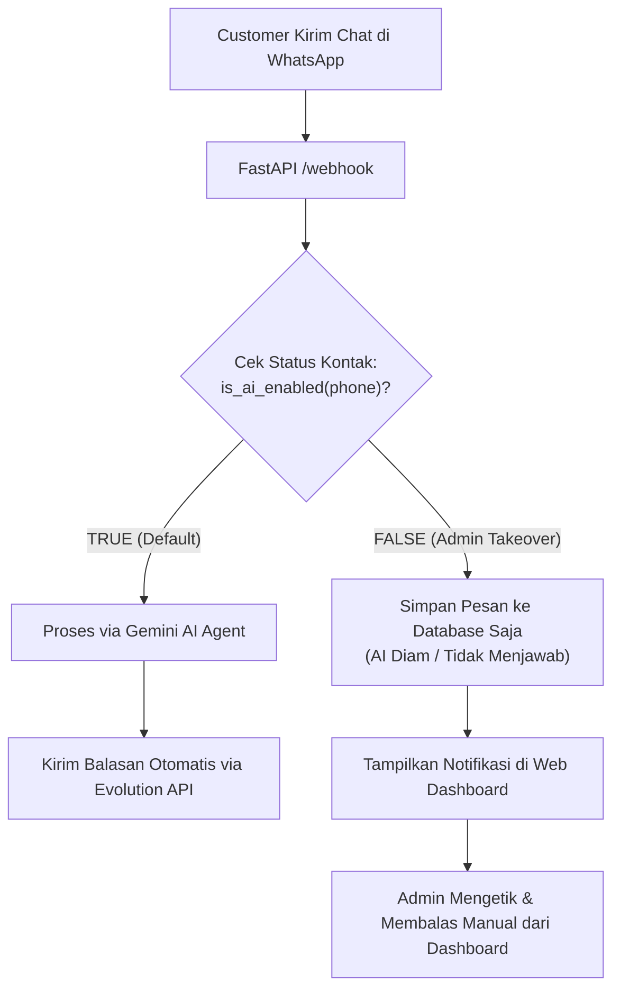

# Modul 06: WhatsApp Integration, Live Dashboard & Human Takeover

Selamat di modul penutup dari seri pembelajaran AI Sales Agent! Di modul ini, kita akan menyatukan seluruh komponen: menghubungkan agen ke WhatsApp menggunakan **Evolution API**, menguji interaksi melalui simulator **CLI**, serta mengoperasikan **Live Dashboard** dan mekanisme **Human Takeover**.

---

## 🎯 Tujuan Pembelajaran

Setelah menyelesaikan modul ini, Anda akan mampu:
1. Memahami integrasi **Evolution API** untuk mengirim teks dan efek status mengetik (*typing indicator*).
2. Menjalankan pengujian interaktif lokal menggunakan [`cli.py`](../cli.py) tanpa memerlukan nomor fisik WhatsApp.
3. Membedah arsitektur backend dashboard pada [`routes/dashboard.py`](../routes/dashboard.py) dan antarmuka web [`templates/dashboard.html`](../templates/dashboard.html).
4. Menerapkan pola **Human Takeover** (`is_ai_enabled`) untuk mengalihkan chat dari AI ke admin klinik manusia.
5. Memahami konfigurasi deployment production (`Procfile`, Railway/Zeabur, ngrok).

---

## 🧩 Konsep Human-in-the-Loop & Gateway Pesan

AI tidak dirancang untuk menggantikan 100% peran manusia, melainkan mengotomatiskan 80–90% tugas repetitif (menjawab promo, konsultasi katalog dasar, mengecek jadwal dokter, dan membuat booking). 

Ketika customer memiliki komplain sensitif atau meminta bicara dengan manajer klinik, sistem menerapkan pola **Human-in-the-Loop**:



---

## 🔍 Bedah Kode Mendalam

### 1. Simulasi Mengetik Manusiawi di `whatsapp.py`
Buka berkas [`whatsapp.py`](../whatsapp.py):
```python
TYPING_SECONDS_PER_CHAR = 0.03   # ~33 karakter/detik
TYPING_MIN_SECONDS = 1.0
TYPING_MAX_SECONDS = 5.0

def _typing_duration(text: str) -> float:
    return min(max(len(text) * TYPING_SECONDS_PER_CHAR, TYPING_MIN_SECONDS), TYPING_MAX_SECONDS)
```
* **Alasan Desain**: Bot yang membalas 3 kalimat panjang dalam 0.1 detik terasa sangat mencolok sebagai robot dan rawan dilaporkan sebagai spam oleh pengguna WhatsApp. Dengan menghitung panjang karakter dan menampilkan status *"sedang mengetik..."* selama 1–3 detik, pengalaman chat terasa jauh lebih hangat dan manusiawi.

Fungsi `send_reply()` memecah output AI berdasarkan `[NEXT]` dan mengirimkannya secara bertahap:
```python
async def send_reply(phone: str, reply: str) -> None:
    # 1. Bersihkan marker internal
    clean = reply.replace("[WAIT]", "").replace("[HANDOVER]", "").strip()
    bubbles = [b.strip() for b in clean.split("[NEXT]") if b.strip()]

    async with httpx.AsyncClient(timeout=15.0) as client:
        for idx, bubble in enumerate(bubbles):
            if idx > 0:
                await asyncio.sleep(1.0)  # Jeda antar bubble
            # Kirim indikator mengetik
            duration = _typing_duration(bubble)
            await send_typing(client, phone, duration)
            await asyncio.sleep(duration)
            # Kirim pesan teks
            await send_text(client, phone, bubble)
```

---

### 2. Simulator WhatsApp Offline (`cli.py`)
Buka berkas [`cli.py`](../cli.py). Berkas ini adalah alat bantu terpenting saat proses pengembangan:
```python
DUMMY_PHONE = "6281234567890"

def main():
    init_db()
    seed_db()
    history = []
    while True:
        user_input = input("\nCustomer > ").strip()
        # ...
        reply, history = run_agent(history, user_input, phone=DUMMY_PHONE)
        # Parse bubble [NEXT] dan cetak seperti WhatsApp
        clean = reply.replace("[WAIT]", "").replace("[HANDOVER]", "\n  ⚠ [HANDOVER terdeteksi]")
        for bubble in clean.split("[NEXT]"):
            print(f"\nGita    > {bubble.strip()}")
```
* **Keuntungan**: Anda dapat menguji seluruh skenario percakapan, function calling, dan booking tanpa perlu setup ngrok, tanpa kuota WhatsApp, dan tanpa smartphone fisik!

---

### 3. Dashboard Operasional & Human Takeover (`routes/dashboard.py`)
Dashboard menyajikan halaman monitoring untuk staf klinik:
* **Autentikasi Header**: Setiap pemanggilan API diproteksi dengan header `X-API-Key` yang dicocokkan dengan `DASHBOARD_API_KEY` di file `.env`.
* **Daftar Percakapan (`/dashboard/api/conversations`)**: Menampilkan daftar kontak terbaru, pesan terakhir, dan status saklar AI (`is_ai_enabled`).
* **Saklar Takeover (`/dashboard/api/toggle-ai`)**:
  ```python
  @router.post("/dashboard/api/toggle-ai")
  def toggle_ai(phone: str = Body(..., embed=True), enabled: bool = Body(..., embed=True)):
      with get_session() as s:
          contact = s.get(Contact, phone)
          if contact:
              contact.is_ai_enabled = enabled
              s.add(contact)
              s.commit()
      return {"ok": True, "phone": phone, "is_ai_enabled": enabled}
  ```
* **Balas Manual (`/dashboard/api/reply`)**: Memungkinkan admin mengetik pesan langsung dari dashboard dan mengirimkannya ke WhatsApp customer via Evolution API.
* **Manajemen Booking (`/dashboard/api/bookings`)**: Menampilkan daftar pesanan jadwal, memfilter berdasarkan status (`confirmed`, `cancelled`), dan mengubah status tindakan.

---

### 4. Ringkasan Deployment Production
Untuk mempublikasikan agen ke server produksi (misal: Railway, Zeabur, atau VPS):
1. **Procfile**: Berisi perintah eksekusi server:
   ```text
   web: uvicorn main:app --host 0.0.0.0 --port $PORT
   ```
2. **Setup ngrok (Lokal Development)**:
   ```bash
   ngrok http 8000
   ```
   Salin URL public HTTPS ngrok (contoh: `https://abcd-1234.ngrok-free.app`) dan daftarkan ke webhook Evolution API dengan endpoint `/webhook`.

---

## 🧪 Hands-on Lab: Simulasi Lengkap via CLI

Mari kita coba jalankan simulasi percakapan nyata dari konsultasi awal hingga booking sukses menggunakan CLI.

### 1. Jalankan CLI di Terminal Anda
```bash
python3 cli.py
```

### 2. Contoh Dialog Uji Coba:
Ketikkan pesan-pesan berikut secara berurutan di prompt `Customer >`:

1. **Menyapa & Bertanya Treatment**:
   ```text
   Customer > Halo kak, wajah saya bruntusan dan komedoan, ada facial yang cocok?
   ```
   *Amati*: Gita akan menyapa ramah, memanggil tool `search_treatments`, dan menjelaskan paket facial yang sesuai beserta harganya.

2. **Menanyakan Jadwal & Ketersediaan**:
   ```text
   Customer > Tertarik kak, besok jam 11 siang bisa?
   ```
   *Amati*: Gita mencatat jam yang diminta dan menanyakan nama Anda untuk reservasi.

3. **Konfirmasi Booking**:
   ```text
   Customer > Atas nama Clarissa kak
   ```
   *Amati*: Gita memanggil tool `book_treatment`, memeriksa kapasitas slot, dan memberikan rincian konfirmasi lengkap beserta kode booking unik (misal `GLW-8A2F`).

4. **Keluar dari Simulator**:
   Ketik `exit` atau tekan `Ctrl + C`.

---

## ⚠️ Pitfalls & Gotchas

1. **Pemblokiran Nomor WhatsApp**:
   - Jika Anda mengirim pesan siaran (*broadcast*) massal tanpa jeda, nomor WhatsApp Anda dapat diblokir oleh sistem deteksi Meta. Selalu gunakan penundaan waktu alami (`_typing_duration`) dan gunakan nomor WhatsApp resmi/khusus bisnis.
2. **Status Takeover Tertinggal**:
   - Jika staf admin selesai melayani customer secara manual, jangan lupa untuk mengaktifkan kembali saklar `is_ai_enabled` ke posisi `ON` agar customer tidak terabaikan saat chat lagi di masa depan.

---

## 🚀 Tantangan Mandiri (Mini Challenge - Final Capstone)

Sebagai tantangan akhir kelulusan Anda:
1. Jalankan `python3 cli.py`.
2. Lakukan booking hingga selesai dan catat kode booking yang Anda peroleh.
3. Kirim pesan: *"Kak saya mau batalkan booking [KODE-BOOKING] karena ada acara mendadak"*.
4. Amati bagaimana Gita memanggil fungsi `cancel_booking` dan memperbarui status pesanan Anda di database secara otomatis!

---

## 🎓 Selamat! Anda Telah Menyelesaikan Seluruh Modul

Anda kini telah menguasai seluruh spektrum arsitektur **AI Sales Agent**:
- [x] **Layer Data**: Persistensi SQLModel, kapasitas perawat simultan, dan jadwal klinik.
- [x] **Layer Prompting**: Persona Gita, tone 5/10, guardrails medis, dan protokol `[NEXT]` / `[WAIT]`.
- [x] **Layer Tools & Agen**: Gemini Function Calling, multi-turn reasoning loop, dan vision multimodal.
- [x] **Layer Webhook & State**: Debounce buffer asyncio 8 detik, sliding window memory, dan storage media.
- [x] **Layer Operasional**: Gateway Evolution API, CLI testing, dan live human takeover dashboard.

Kembali ke halaman utama untuk meninjau roadmap atau modul lainnya:
👉 **[Kembali ke Hub Navigasi Modul (README.md)](./README.md)**
