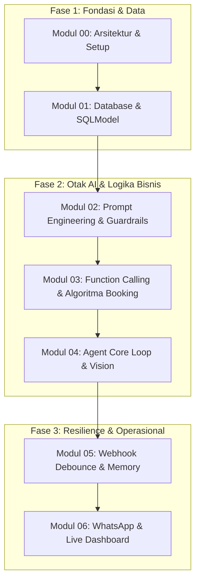

# Panduan & Roadmap Modul Pembelajaran: AI Sales Agent Workshop

Selamat datang di seri modul pembelajaran resmi untuk repositori **AI Sales Agent Workshop (Glowria Aesthetic Clinic)**. Seri tutorial ini dirancang agar Anda dapat memahami, membedah, dan mengembangkan arsitektur agen AI percakapan kelas produksi (*production-grade conversational agent*) yang terintegrasi dengan WhatsApp.

---

## 🗺️ Peta Jalur Belajar (Roadmap)

Modul-modul ini disusun secara berurutan mengikuti pendekatan **Modular Component Journey** (dari fondasi data, kecerdasan prompt, eksekusi tools, loop agen, ketahanan webhook, hingga integrasi WhatsApp & dashboard operasional):

---

## 📚 Daftar Modul

| No | Modul | Berkas Sumber Terkait | Topik Inti | Est. Waktu |
|:---|:---|:---|:---|:---|
| **00** | [Pengenalan Arsitektur & Lingkungan Belajar](./00-pengenalan-arsitektur-dan-lingkungan.md) | `.env.example`, `pyproject.toml` | Mental model sistem, alur pesan WhatsApp, instalasi virtualenv & sanity check API | 20 menit |
| **01** | [Database & Data Modeling](./01-database-dan-data-modeling.md) | `database.py` | SQLModel, skema 7 entitas (Treatment, Booking, Schedules, Chat), dan seeding data | 30 menit |
| **02** | [Prompt Engineering & Guardrails](./02-prompt-engineering-dan-guardrails.md) | `prompts/system.md`, `agent.py` | Persona Gita, tone 5/10, hard rules klinik, delimiter `[NEXT]`, `[WAIT]`, `[HANDOVER]` | 35 menit |
| **03** | [Function Calling & Booking Engine](./03-function-calling-dan-booking-engine.md) | `tools.py` | Gemini Tool Declarations, algoritma kapasitas 3 perawat paralel, atomic slot check | 45 menit |
| **04** | [The Agent Core Loop & Multimodal Vision](./04-agent-core-dan-gemini-loop.md) | `agent.py` | GenAI SDK loop, multi-turn reasoning, eksekusi tool berulang, input gambar foto kulit | 40 menit |
| **05** | [Session State, Debounce Webhook & Storage](./05-webhook-debounce-dan-memory.md) | `main.py`, `memory.py` | Sliding window memory, buffer debounce 8 detik untuk chat cepat, Cloudflare R2 | 35 menit |
| **06** | [WhatsApp Integration, CLI & Dashboard](./06-whatsapp-integration-dan-dashboard.md) | `whatsapp.py`, `cli.py`, `routes/dashboard.py` | Evolution API, delay mengetik, CLI test runner, live human takeover | 40 menit |

---

## 🏗️ Arsitektur Sistem Singkat

Arsitektur AI Sales Agent ini dirancang untuk menjawab tantangan komunikasi di WhatsApp:
1. **Kurir Pesan (Evolution API)**: Menjembatani WhatsApp customer dengan server backend melalui protokol HTTP/Webhook.
2. **Orkestrator & Debounce (FastAPI `main.py`)**: Mencegah pemborosan token dan balasan yang bertabrakan saat customer mengirim chat terpotong-potong.
3. **Otak Keputusan (Gemini via `agent.py`)**: Menggunakan model `gemini-3.1-flash-lite` dengan instruksi ketat dari `system.md`.
4. **Alat Eksekusi (`tools.py`)**: Memberikan kemampuan aksi riil kepada AI (mencari katalog perawatan, menghitung kapasitas perawat, dan membuat booking atomik).
5. **Ingatan Percakapan (`memory.py`)**: Menyimpan riwayat chat secara persisten dengan sliding window dan session timeout.
6. **Kontrol Manusia (`routes/dashboard.py`)**: Memungkinkan staf klinik mengambil alih percakapan sewaktu-waktu (*Human-in-the-loop*).

Untuk melihat diagram visual lengkap resolusi tinggi, buka file [arsitektur-day1.svg](../arsitektur-day1.svg).

---

## 🛠️ Prasyarat & Persiapan

Sebelum memulai Modul 00, pastikan Anda memiliki:
1. **Python 3.10 atau lebih baru** (`python3 --version`).
2. **Paket manager `uv` (sangat disarankan)** atau `pip`.
3. **Gemini API Key**: Dapatkan secara gratis melalui [Google AI Studio](https://aistudio.google.com).
4. Terminal Linux / macOS / WSL2.

---

## 🚀 Langkah Selanjutnya

Mulai perjalanan belajar Anda dari modul pertama:
👉 **[Lanjut ke Modul 00: Pengenalan Arsitektur & Lingkungan Belajar](./00-pengenalan-arsitektur-dan-lingkungan.md)**
